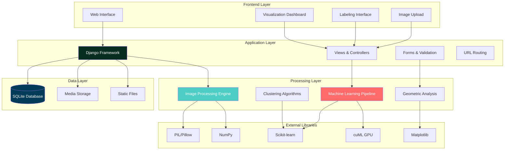
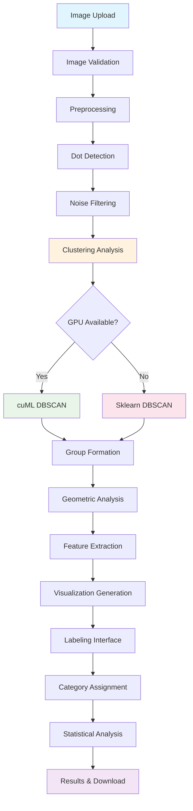
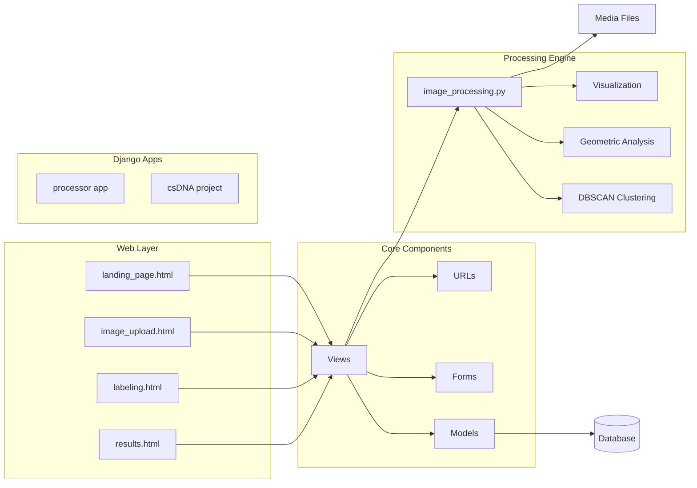
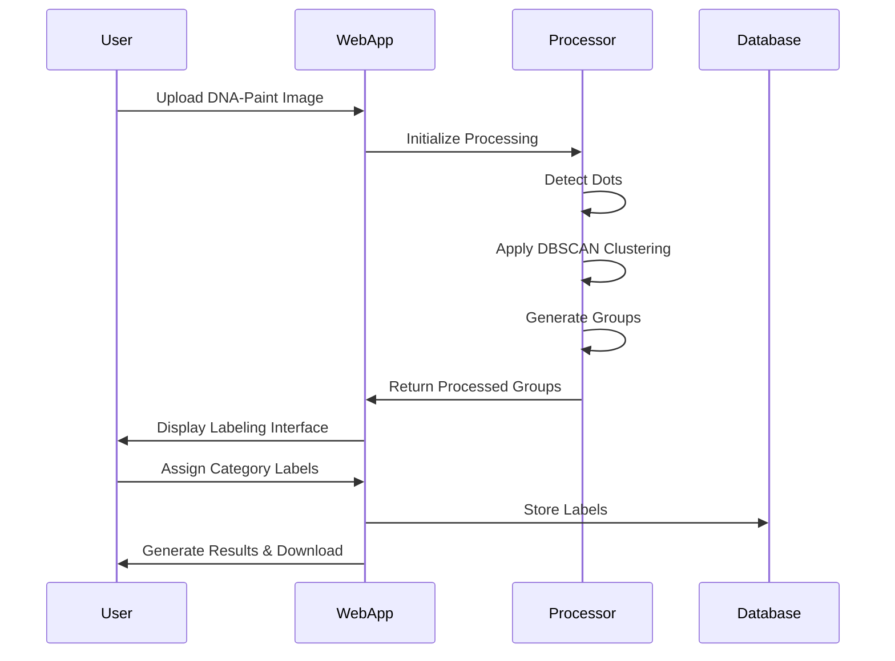

# csDNA - Computer Science DNA Image Analyzer

[](https://python.org)
[](https://djangoproject.com)
[](LICENSE)

A sophisticated web-based platform for analyzing DNA-Paint images using advanced machine learning algorithms and computer vision techniques. The system provides automated clustering, geometric analysis, and comprehensive visualization tools for DNA origami structures.

## 🎯 Overview

csDNA is designed to process and analyze DNA-Paint microscopy images, automatically identifying and categorizing DNA origami structures through advanced clustering algorithms. The platform combines web-based accessibility with powerful backend processing capabilities, making complex DNA structure analysis accessible to researchers and scientists.

### Key Features

- **🔬 Advanced Image Processing**: Automated dot detection and noise filtering
- **🤖 Machine Learning Clustering**: GPU-accelerated DBSCAN and K-means clustering
- **📊 Interactive Visualization**: Real-time plots and statistical analysis
- **🏷️ Smart Labeling System**: Automated and manual categorization
- **📱 Web-Based Interface**: Responsive Django web application
- **⚡ GPU Acceleration**: CUDA support for high-performance processing
- **📈 Comprehensive Analytics**: Detailed statistical reports and insights

## 🏗️ System Architecture

### High-Level Architecture



### Data Flow Architecture



### Component Architecture



## 🛠️ Technology Stack

### Backend Technologies

| Technology | Version | Purpose | Documentation |
|------------|---------|---------|---------------|
| **Python** | 3.8+ | Core programming language | [python.org](https://python.org) |
| **Django** | 5.0 | Web framework | [djangoproject.com](https://djangoproject.com) |
| **SQLite** | 3.x | Database | [sqlite.org](https://sqlite.org) |

### Image Processing & ML

| Library | Purpose | GPU Support |
|---------|---------|-------------|
| **Pillow (PIL)** | Image manipulation and processing | ❌ |
| **NumPy** | Numerical computations and array operations | ❌ |
| **OpenCV** | Computer vision and image processing | ✅ |
| **scikit-learn** | Machine learning algorithms (fallback) | ❌ |
| **cuML** | GPU-accelerated machine learning | ✅ |
| **DBSCAN** | Density-based clustering algorithm | ✅ |
| **K-means** | Centroid-based clustering | ✅ |

### Visualization & Analytics

| Library | Purpose | Features |
|---------|---------|----------|
| **Matplotlib** | Static plotting and visualization | Charts, histograms, scatter plots |
| **Plotly** | Interactive visualizations | 3D plots, interactive dashboards |
| **Seaborn** | Statistical data visualization | Advanced statistical plots |

### Data Handling

| Library | Purpose | File Types |
|---------|---------|------------|
| **h5py** | HDF5 file handling | .h5, .hdf5 |
| **Pandas** | Data manipulation and analysis | CSV, Excel, JSON |

### Frontend Technologies

| Technology | Purpose |
|------------|---------|
| **HTML5** | Markup and structure |
| **CSS3** | Styling and responsive design |
| **JavaScript** | Client-side interactivity |
| **Bootstrap** | UI components and grid system |

## 📋 Prerequisites

### System Requirements

- **Operating System**: Linux, macOS, or Windows
- **Python**: 3.8 or higher
- **Memory**: Minimum 4GB RAM (8GB+ recommended for large datasets)
- **Storage**: 2GB+ free space
- **GPU** (Optional): CUDA-compatible GPU for accelerated processing

### Required Software

```bash
# Python 3.8+
python --version

# pip package manager
pip --version

# Git (for cloning repository)
git --version
```

## 🚀 Installation & Setup

### 1. Clone the Repository

```bash
git clone https://github.com/sbeeredd04/CSDNA.git
cd CSDNA
```

### 2. Create Virtual Environment

```bash
# Create virtual environment
python -m venv venv

# Activate virtual environment
# On Linux/macOS:
source venv/bin/activate
# On Windows:
venv\Scripts\activate
```

### 3. Install Dependencies

```bash
# Install Python packages
pip install -r requirements.txt

# For GPU acceleration (optional)
pip install cuml-cu11  # For CUDA 11.x
# or
pip install cuml-cu12  # For CUDA 12.x
```

### 4. Configure Django

```bash
# Run database migrations
python manage.py migrate

# Create superuser (optional)
python manage.py createsuperuser

# Collect static files
python manage.py collectstatic
```

### 5. Start Development Server

```bash
python manage.py runserver
```

Visit `http://localhost:8000` to access the application.

## 📖 Usage Guide

### Basic Workflow



### Step-by-Step Instructions

#### 1. Image Upload
1. Navigate to the home page
2. Click "Get Started" 
3. Upload your DNA-Paint image (PNG format recommended)
4. Configure processing parameters:
   - **Group Radius**: Distance threshold for clustering (default: 50)
   - **Minimum Dots**: Minimum points per cluster (default: 100)
   - **Threshold**: Intensity threshold for dot detection (default: 60)
   - **Circle Color**: Visualization color for detected groups
   - **Circle Width**: Line width for group boundaries

#### 2. Processing & Analysis
The system automatically:
- Detects dots in the image using intensity thresholding
- Applies noise filtering to remove artifacts
- Performs DBSCAN clustering to group related dots
- Generates geometric analysis of each group
- Creates visualization overlays

#### 3. Labeling & Categorization
1. Review detected groups in the labeling interface
2. Assign categories to each group based on your research criteria
3. Use the interactive tools to zoom and inspect details
4. Save your labels for statistical analysis

#### 4. Results & Export
- View comprehensive statistics and visualizations
- Download categorized images as ZIP files
- Export data as CSV for further analysis
- Generate publication-ready plots

### Processing Parameters Guide

| Parameter | Range | Description | Impact |
|-----------|-------|-------------|---------|
| Group Radius | 10-200 | Clustering distance threshold | Higher = larger groups |
| Min Dots | 10-500 | Minimum points per group | Higher = fewer, denser groups |
| Threshold | 0-255 | Intensity cutoff for dot detection | Higher = fewer, brighter dots |

## 🔌 API Documentation

### Core Endpoints

#### Image Upload
```http
POST /upload/
Content-Type: multipart/form-data

Parameters:
- image: Image file
- group_radius: int (default: 50)
- min_dots: int (default: 100)
- threshold: int (default: 60)
- circle_color: string (default: 'green')
- circle_width: int (default: 8)
- num_categories: int
```

#### Image Processing
```http
GET /upload/result/
Returns: Processed image groups and statistics
```

#### Labeling Interface
```http
GET /upload/label/
POST /upload/label/
Parameters:
- group_id: int
- category: string
```

#### Data Export
```http
GET /upload/download-images-by-category/{category_id}/
Returns: ZIP file with categorized images
```

### Database Models

#### ImageUpload Model
```python
class ImageUpload(models.Model):
    image = models.ImageField(upload_to='uploads/')
```

#### LabeledImage Model
```python
class LabeledImage(models.Model):
    image_path = models.CharField(max_length=255)
    label = models.CharField(max_length=50)
```

#### Category Model
```python
class Category(models.Model):
    key = models.CharField(max_length=50, unique=True)
    name = models.CharField(max_length=100, default='Category')
    count = models.IntegerField(default=0)
```

## 🧪 Development

### Project Structure

```
csDNA/
├── csDNA/                  # Django project configuration
│   ├── settings.py         # Django settings
│   ├── urls.py            # Main URL configuration
│   └── wsgi.py            # WSGI application
├── processor/             # Main Django application
│   ├── models.py          # Database models
│   ├── views.py           # View controllers
│   ├── forms.py           # Form definitions
│   ├── urls.py            # URL patterns
│   ├── image_processing.py # Core processing engine
│   ├── templates/         # HTML templates
│   └── static/            # CSS, JS, images
├── Testing code/          # Analysis and testing scripts
│   └── Origami Analysis/  # DNA origami analysis tools
├── media/                 # User uploaded files
├── staticfiles/          # Collected static files
├── requirements.txt      # Python dependencies
└── manage.py            # Django management script
```

### Adding New Features

#### 1. Create New Processing Algorithm
```python
# In processor/image_processing.py
def new_algorithm(image_array, **params):
    """
    Add your new processing algorithm here
    """
    # Implementation
    return processed_data
```

#### 2. Add New Database Model
```python
# In processor/models.py
class NewModel(models.Model):
    field_name = models.CharField(max_length=100)
    # Add fields as needed
```

#### 3. Create New View
```python
# In processor/views.py
def new_view(request):
    # Handle request logic
    return render(request, 'template.html', context)
```

### Testing

```bash
# Run Django tests
python manage.py test

# Run specific app tests
python manage.py test processor

# Run with coverage
pip install coverage
coverage run --source='.' manage.py test
coverage report
```

### Code Style

```bash
# Format code with black
pip install black
black .

# Lint with flake8
pip install flake8
flake8 .

# Type checking with mypy
pip install mypy
mypy .
```

## 🔬 Scientific Background

### DNA-Paint Imaging

DNA-Paint (DNA Points Accumulation for Imaging in Nanoscale Topography) is a super-resolution microscopy technique that allows visualization of cellular structures at nanometer resolution. This application specifically analyzes:

- **DNA Origami Structures**: Self-assembled DNA nanostructures
- **Clustering Patterns**: Spatial distribution of fluorescent markers
- **Geometric Properties**: Shape analysis and dimensional measurements

### Clustering Algorithms

#### DBSCAN (Density-Based Spatial Clustering)
- **Purpose**: Groups dots based on density and proximity
- **Advantages**: Handles noise, finds arbitrary shapes
- **Parameters**: 
  - `eps`: Maximum distance between points in a cluster
  - `min_samples`: Minimum points required to form a cluster

#### K-Means Clustering
- **Purpose**: Partitions data into k clusters
- **Advantages**: Fast, works well with spherical clusters
- **Parameters**:
  - `k`: Number of clusters
  - `init`: Initialization method

## 📊 Performance Optimization

### GPU Acceleration

The system automatically detects and utilizes GPU acceleration when available:

```python
# GPU detection and fallback
try:
    from cuml.cluster import DBSCAN
    use_gpu = True
    print("Using GPU for DBSCAN")
except ImportError:
    from sklearn.cluster import DBSCAN
    use_gpu = False
```

### Memory Management

For large datasets:
- Images are processed in chunks
- Temporary files are cleaned automatically
- Database connections are optimized
- Media files are compressed when possible

### Performance Benchmarks

| Dataset Size | CPU Time | GPU Time | Memory Usage |
|--------------|----------|----------|--------------|
| 100 KB image | 2-5 sec | 1-2 sec | 200 MB |
| 1 MB image | 10-20 sec | 3-8 sec | 500 MB |
| 10 MB image | 60-120 sec | 15-30 sec | 2 GB |

## 🚨 Troubleshooting

### Common Issues

#### GPU Not Detected
```bash
# Check CUDA installation
nvidia-smi

# Install cuML
pip install cuml-cu11
```

#### Memory Errors
```bash
# Increase system memory or reduce image size
# Monitor memory usage
htop  # Linux/macOS
# or Task Manager on Windows
```

#### Import Errors
```bash
# Reinstall dependencies
pip install -r requirements.txt --force-reinstall
```

#### Database Issues
```bash
# Reset database
python manage.py flush
python manage.py migrate
```

### Debug Mode

Enable debug mode for development:

```python
# In csDNA/settings.py
DEBUG = True
ALLOWED_HOSTS = ['localhost', '127.0.0.1']
```

## 🤝 Contributing

### Contribution Guidelines

1. **Fork the Repository**
2. **Create Feature Branch**
   ```bash
   git checkout -b feature/new-feature
   ```
3. **Make Changes**
   - Follow PEP 8 style guidelines
   - Add tests for new functionality
   - Update documentation
4. **Test Changes**
   ```bash
   python manage.py test
   ```
5. **Submit Pull Request**

### Development Workflow

```mermaid
gitgraph
    commit id: "Initial"
    branch feature
    checkout feature
    commit id: "Feature A"
    commit id: "Tests"
    commit id: "Documentation"
    checkout main
    merge feature
    commit id: "Release"
```

### Code Review Process

1. **Automated Checks**: Code style, tests, security
2. **Peer Review**: Technical review by maintainers
3. **Testing**: Manual testing of new features
4. **Documentation**: Update README and docs
5. **Merge**: Integration into main branch

## 📄 License

This project is licensed under the MIT License. See the [LICENSE](LICENSE) file for details.

## 🙏 Acknowledgments

- **Django Framework**: Web development framework
- **RAPIDS cuML**: GPU-accelerated machine learning
- **scikit-learn**: Machine learning library
- **Matplotlib**: Visualization library
- **PIL/Pillow**: Image processing library

## 📞 Support

### Getting Help

- **Issues**: [GitHub Issues](https://github.com/sbeeredd04/CSDNA/issues)
- **Documentation**: This README and inline code comments
- **Community**: Discussions in GitHub Discussions

### Reporting Bugs

When reporting bugs, please include:
1. Operating system and Python version
2. Steps to reproduce the issue
3. Expected vs actual behavior
4. Error messages and logs
5. Sample images (if applicable)

## 🔮 Roadmap

### Upcoming Features

- [ ] **Cloud Processing**: Integration with cloud computing platforms
- [ ] **3D Visualization**: Three-dimensional structure analysis
- [ ] **Batch Processing**: Multiple image processing workflows
- [ ] **API Extensions**: RESTful API for external integrations
- [ ] **Mobile Support**: Responsive design improvements
- [ ] **Advanced Analytics**: Machine learning model training
- [ ] **Export Formats**: Additional data export options

### Version History

| Version | Date | Features |
|---------|------|----------|
| 1.0.0 | 2024 | Initial release with basic functionality |
| 1.1.0 | TBD | GPU acceleration and improved UI |
| 1.2.0 | TBD | Batch processing and cloud integration |

---

*For the latest updates and announcements, please check the [GitHub repository](https://github.com/sbeeredd04/CSDNA).*