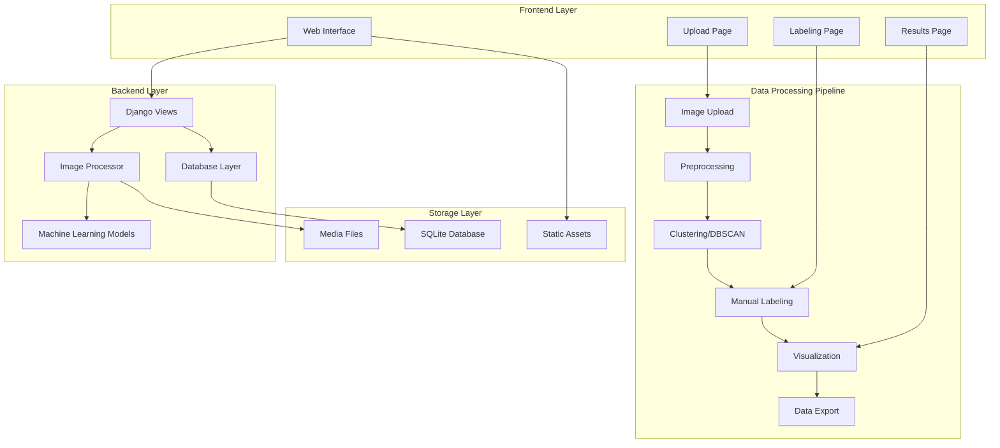
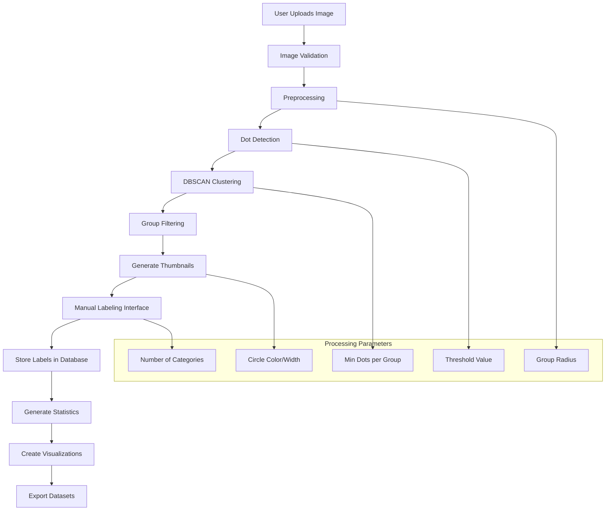
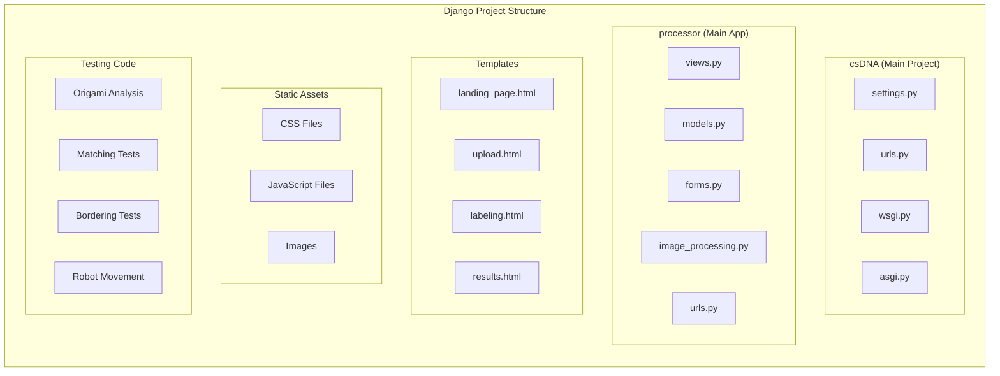
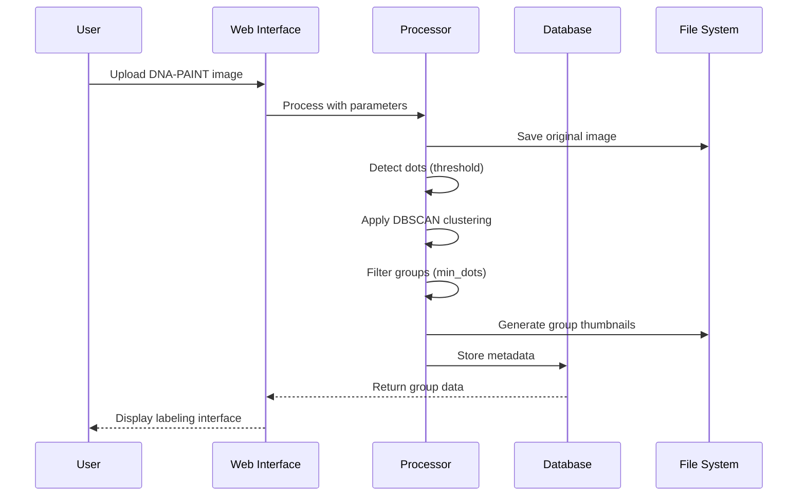

# csDNA Image Analyzer

<p align="center">
  
  
  
  
</p>

A comprehensive web-based image analysis platform specifically designed for DNA-PAINT (DNA Points Accumulation for Imaging in Nanoscale Topography) microscopy images. This tool provides automated clustering, manual labeling, and statistical analysis capabilities for biological image research.

## 🧬 Overview

csDNA Image Analyzer is a Django web application that enables researchers to:
- Upload and process DNA-PAINT microscopy images
- Automatically detect and cluster molecular structures
- Manually label and categorize identified clusters
- Generate statistical visualizations and downloadable datasets
- Perform advanced image analysis using machine learning algorithms

## 🏗️ Architecture

### System Architecture



### Data Flow Architecture



### Component Architecture



## 🛠️ Tech Stack

### Backend Technologies
- **Django 5.2+**: Web framework for rapid development
- **Python 3.8+**: Core programming language
- **SQLite**: Database for development and small deployments
- **PIL/Pillow**: Image processing and manipulation
- **NumPy**: Numerical computing and array operations

### Machine Learning & Computer Vision
- **scikit-learn**: Machine learning algorithms (DBSCAN clustering)
- **OpenCV**: Computer vision and image processing
- **cuML**: GPU-accelerated machine learning (optional, fallback to scikit-learn)

### Data Visualization & Analysis
- **Matplotlib**: Statistical plotting and chart generation
- **Plotly**: Interactive web-based visualizations
- **Seaborn**: Statistical data visualization
- **Pandas**: Data manipulation and analysis

### Frontend Technologies
- **HTML5/CSS3**: Modern web standards
- **JavaScript**: Client-side interactivity
- **Bootstrap-inspired CSS**: Responsive design components

### Development & Deployment
- **Pipenv**: Dependency management
- **Django Static Files**: Asset management
- **Django Media Handling**: File upload management

## 🚀 Quick Start

### Prerequisites

- Python 3.8 or higher
- pip package manager
- Virtual environment (recommended)

### Installation

1. **Clone the repository**
   ```bash
   git clone https://github.com/sbeeredd04/CSDNA.git
   cd CSDNA
   ```

2. **Create and activate virtual environment**
   ```bash
   python -m venv venv
   source venv/bin/activate  # On Windows: venv\Scripts\activate
   ```

3. **Install dependencies**
   ```bash
   pip install -r requirements.txt
   ```

4. **Configure the database**
   ```bash
   python manage.py migrate
   ```

5. **Create a superuser (optional)**
   ```bash
   python manage.py createsuperuser
   ```

6. **Run the development server**
   ```bash
   python manage.py runserver
   ```

7. **Access the application**
   - Open your browser and navigate to `http://localhost:8000`
   - The landing page will guide you through the image analysis workflow

## 📊 Usage

### 1. Image Upload and Processing



**Processing Parameters:**
- **Group Radius**: Distance threshold for clustering (default: 50)
- **Min Dots**: Minimum dots required per group (default: 100)
- **Threshold**: Pixel intensity threshold (default: 60)
- **Circle Color**: Visualization color for groups
- **Circle Width**: Border width for group visualization
- **Number of Categories**: Labels available for classification

### 2. Manual Labeling Workflow

The labeling interface allows users to:
- View detected groups as thumbnail images
- Assign categories (1, 2, 3, etc.) to each group
- Navigate through groups systematically
- Save progress and continue later

### 3. Data Export and Analysis

After labeling completion:
- Download categorized image datasets (ZIP format)
- Generate statistical visualizations (pie charts, histograms)
- Export metadata as CSV files

## 🧪 Testing and Research Components

### Origami Analysis Module
Located in `Testing code/Origami Analysis/`, this module provides:
- Comprehensive DNA origami structure analysis
- Geometric measurement tools
- Ratio calculations and statistical analysis
- Detailed documentation for researchers

### Image Matching Algorithms
The `Testing code/Matching Test/` directory contains:
- Feature extraction using VGG16
- Cosine similarity calculations
- SSIM (Structural Similarity Index) analysis

### Additional Research Tools
- **Bordering Tests**: Edge detection and boundary analysis
- **Robot Movement**: Automated analysis workflows
- **Test Modules**: Various experimental algorithms

## 🗂️ Project Structure

```
csDNA/
├── csDNA/                  # Django project configuration
│   ├── settings.py         # Application settings
│   ├── urls.py            # URL routing
│   └── wsgi.py            # WSGI configuration
├── processor/             # Main application
│   ├── models.py          # Database models
│   ├── views.py           # View controllers
│   ├── forms.py           # Form definitions
│   ├── image_processing.py # Core image processing
│   ├── templates/         # HTML templates
│   └── static/           # CSS, JS, images
├── Testing code/         # Research modules
│   ├── Origami Analysis/ # DNA origami tools
│   ├── Matching Test/    # Image similarity
│   ├── Bordering Test/   # Edge detection
│   └── Robot Movement/   # Automation tools
├── media/               # User uploads
├── staticfiles/         # Collected static files
├── requirements.txt     # Python dependencies
└── manage.py           # Django management
```

## 🔧 Configuration

### Environment Variables

Create a `.env` file for production deployment:

```env
SECRET_KEY=your-secret-key-here
DEBUG=False
ALLOWED_HOSTS=your-domain.com,www.your-domain.com
DATABASE_URL=your-database-url
```

### Production Settings

For production deployment, modify `csDNA/settings.py`:

- Set `DEBUG = False`
- Configure `ALLOWED_HOSTS`
- Use a production database (PostgreSQL recommended)
- Configure static file serving
- Set up proper logging

## 📝 API Reference

### Models

#### ImageUpload
```python
class ImageUpload(models.Model):
    image = models.ImageField(upload_to='uploads/')
```

#### LabeledImage
```python
class LabeledImage(models.Model):
    image_path = models.CharField(max_length=255)
    label = models.CharField(max_length=50)
```

#### Category
```python
class Category(models.Model):
    key = models.CharField(max_length=50, unique=True)
    name = models.CharField(max_length=100, default='Category')
    count = models.IntegerField(default=0)
```

### Key Functions

#### Image Processing Pipeline
```python
def process_images(input_path, group_radius=50, min_dots=100, 
                  threshold=60, circle_color='green', circle_width=8):
    """
    Main image processing function that handles:
    - Dot detection using threshold filtering
    - DBSCAN clustering for group identification
    - Group filtering based on minimum dot count
    - Thumbnail generation for labeling interface
    """
```

## 🧬 Scientific Background

### DNA-PAINT Technology

DNA-PAINT is a super-resolution microscopy technique that uses:
- DNA strand displacement for programmable binding
- Transient binding events for localization
- High-density labeling for nanoscale resolution

### Clustering Algorithm

The application uses DBSCAN (Density-Based Spatial Clustering) because:
- **Noise handling**: Automatically identifies outlier pixels
- **Variable cluster sizes**: Accommodates different molecular structures
- **No predefined cluster count**: Discovers natural groupings
- **GPU acceleration**: Optional cuML support for large datasets

### Statistical Analysis

The platform provides:
- **Distribution analysis**: Category frequency and percentages
- **Spatial metrics**: Cluster density and dispersion
- **Quality metrics**: Signal-to-noise ratios
- **Export formats**: CSV, JSON, and visualization files

## 🚀 Deployment

### Local Development
```bash
python manage.py runserver
```

### Production Deployment

#### Using PythonAnywhere
1. Upload code to PythonAnywhere
2. Configure virtual environment
3. Set up WSGI configuration
4. Configure static files serving

#### Using Docker
```dockerfile
FROM python:3.8-slim
WORKDIR /app
COPY requirements.txt .
RUN pip install -r requirements.txt
COPY . .
CMD ["python", "manage.py", "runserver", "0.0.0.0:8000"]
```

## 🧪 Testing

### Running Tests
```bash
python manage.py test
```

### Test Coverage
The project includes tests for:
- Image upload functionality
- Processing parameter validation
- Database model integrity
- View response codes

## 🤝 Contributing

1. Fork the repository
2. Create a feature branch (`git checkout -b feature/amazing-feature`)
3. Commit your changes (`git commit -m 'Add amazing feature'`)
4. Push to the branch (`git push origin feature/amazing-feature`)
5. Open a Pull Request

### Development Guidelines
- Follow PEP 8 style guide
- Add docstrings to all functions
- Include unit tests for new features
- Update documentation for API changes

## 📄 License

This project is licensed under the MIT License - see the LICENSE file for details.

## 👥 Authors

- **Sai Beerashetty** - *Initial work* - [sbeeredd04](https://github.com/sbeeredd04)

## 🙏 Acknowledgments

- DNA-PAINT methodology researchers
- Django and Python communities
- Scientific computing ecosystem contributors
- Computer vision and machine learning communities

## 📚 References

- Jungmann, R. et al. (2014). Multiplexed 3D cellular super-resolution imaging with DNA-PAINT and Exchange-PAINT. Nature Methods.
- Schnitzbauer, J. et al. (2017). Super-resolution microscopy with DNA-PAINT. Nature Protocols.
- scikit-learn: Machine Learning in Python, JMLR 12, pp. 2825-2830, 2011.

---

<p align="center">
  <strong>Built with ❤️ for the scientific research community</strong>
</p>